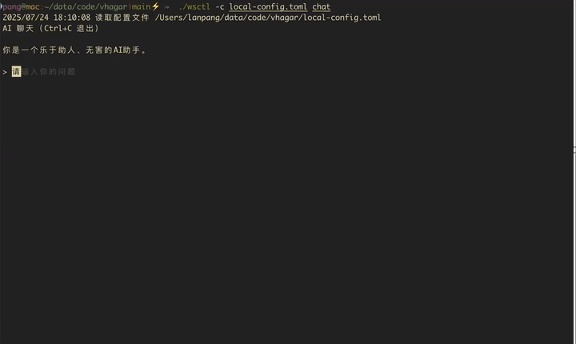
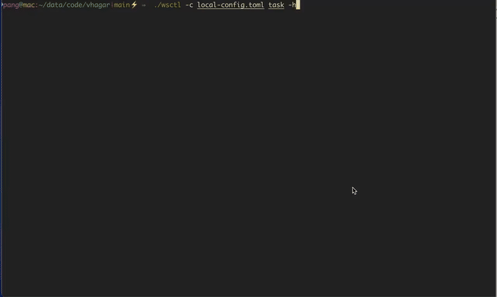

# vhagar

高效的运维管理与中间件巡检工具，集成多种 LLM 服务商，支持智能对话和内容总结，支持工具调用

## 简介

`vhagar` 是一款面向运维场景的综合管理工具，集成了网络测试、定时任务调度、中间件健康巡检与监控指标采集等核心能力，助力提升运维自动化与可观测性。

## 主要特性

- **AI 智能助手**：集成多种 LLM 服务商，支持智能对话和内容总结
- **工具系统**：可扩展的工具调用框架，支持天气查询、系统信息获取等实用功能
- **网络测试**：支持端口连通性检测，快速定位网络问题
- **定时任务**：内置任务调度器，支持周期性任务自动执行
- **中间件巡检**：一键巡检主流中间件（如 Redis、ES、RocketMQ、Doris、Nacos 等）运行状态
- **监控指标**：采集并展示各类服务与中间件的关键指标
- **统一日志**：集成 zap 日志框架，支持多级别、结构化日志输出
- **统一错误处理**：标准化错误码和错误处理机制，便于问题定位

## 功能演示

### AI 聊天



### AI 巡检



## 安装与部署

### 1. 二进制包运行

1. 下载最新 [wsctl 二进制文件](https://private-1253767630.cos.ap-shanghai.myqcloud.com/tools/archive/binary_tag/bin/wsctl) 和 [配置模板](https://private-1253767630.cos.ap-shanghai.myqcloud.com/tools/archive/binary_tag/bin/config.toml)
2. 修改配置文件 `config.toml`
3. 赋予执行权限并启动
   ```bash
   chmod +x wsctl
   ./wsctl
   ```

### 2. Docker 部署

1. 配置好本地 `config.toml`
2. 使用如下 docker-compose 配置启动
   ```yaml
   version: "3.8"
   services:
     vhagar:
       image: ka-tcr.tencentcloudcr.com/middleware/vhagar:v1.0
       container_name: vhagar
       ports:
         - "8089:8089"
       volumes:
         - ./config.toml:/app/config.toml
       restart: unless-stopped
   ```
3. 启动服务
   ```bash
   docker-compose up -d
   ```

## 快速上手

### 启动 Web 服务

默认监听端口为 8099，可通过 `-p` 参数自定义端口：

```bash
./wsctl -p 8888
```

访问 `http://<服务器IP>:8888/` 进入管理界面。

### 查看命令帮助

```bash
./wsctl -h
```

## 常用命令

- `wsctl chat`：启动 AI 聊天服务
- `wsctl crontab`：启动定时任务调度器
- `wsctl metric`：采集并展示监控指标
- `wsctl task`：执行服务巡检任务
- `wsctl version`：查看版本信息

更多命令及参数请通过 `-h` 或 `--help` 查看详细说明。

## 配置说明

### AI 配置

在 `config.toml` 中配置 AI 服务：

```toml
[ai]
enable = true
provider = "openrouter"  # 当前使用的服务商

[ai.providers.openrouter]
api_key = "sk-xxx"
api_url = "https://openrouter.ai/api/v1/chat/completions"
model = "gpt-3.5-turbo"

[ai.providers.openai]
api_key = "sk-xxx"
api_url = "https://api.openai.com/v1/chat/completions"
model = "gpt-4"
```

### 天气工具配置

配置和风天气 API：

```toml
[weather]
api_host = "https://devapi.qweather.com"
api_key = "your_qweather_api_key"
```

### 系统信息工具

系统信息工具无需额外配置，可直接在 AI 聊天中使用。支持的查询类型：

- **CPU 信息**：使用率、逻辑核心数、物理核心数
- **内存信息**：总量、已用、可用、使用率（支持字节和 GB 单位）
- **磁盘信息**：各分区使用情况、容量、使用率
- **综合信息**：一次性获取所有系统信息

使用示例：

- "我的 CPU 使用率怎么样？"
- "内存还够用吗？"
- "帮我检查一下系统整体状态"

### 错误处理

项目采用统一的错误处理机制：

- **错误码分类**：通用错误(10xxx)、AI 错误(20xxx)、工具错误(30xxx)、配置错误(40xxx)、网络错误(50xxx)
- **结构化日志**：所有错误都会记录详细的上下文信息
- **错误包装**：支持错误链追踪，便于问题定位

示例错误处理：

```go
// 创建应用错误
err := libs.NewError(libs.ErrCodeInvalidParam, "参数错误")

// 包装已有错误
err := libs.WrapError(libs.ErrCodeNetworkFailed, "网络请求失败", originalErr)

// 记录错误日志
libs.LogError(err, "操作上下文")
```

## 日志系统

本项目集成 [zap](https://github.com/uber-go/zap) 作为全局日志框架，所有日志输出均通过 zap 统一管理。

- 日志初始化：程序启动时自动完成（见 `main.go`、`libs/logger.go`）
- 推荐调用方式：
  ```go
  libs.Logger.Infow("启动服务", "port", 8080)
  libs.Logger.Errorw("数据库连接失败", "err", err)
  ```
- 日志级别、格式、输出位置可在 `libs/logger.go` 中自定义

## 调试建议

- 默认开发模式（彩色、详细调用栈），如需生产环境可将 `zap.NewDevelopment()` 改为 `zap.NewProduction()`
- 日志输出可扩展到文件、json 格式等，详见 zap 官方文档

## 工具系统

### 工具注册与调用

项目采用插件化的工具系统，支持动态注册和调用各种工具：

```go
// 注册新工具
err := RegisterTool(ToolMeta{
    Name:        "my_tool",
    Description: "我的自定义工具",
    Handler:     myToolHandler,
})

// 调用工具
result, err := CallTool(ctx, "weather", map[string]any{
    "location": "北京",
})
```

### 内置工具

- **天气查询工具**：支持城市名称、LocationID、经纬度查询

  - 工具名：`weather`
  - 参数：`location` (string) - 城市名称或 LocationID 或经纬度
  - 示例：`{"location": "北京"}` 或 `{"location": "116.41,39.92"}`

- **系统信息工具**：获取本机系统资源信息，支持 CPU、内存、磁盘使用情况查询
  - 工具名：`sysinfo`
  - 参数：
    - `type` (string, 必需) - 信息类型：`cpu`、`memory`、`disk`、`all`
    - `details` (boolean, 可选) - 是否返回详细信息，默认为 `false`
  - 示例：`{"type": "cpu"}` 或 `{"type": "all", "details": true}`

### 扩展工具

要添加新工具，请：

1. 在 `chat/tools/` 目录下创建工具实现文件
2. 实现工具处理函数：
   ```go
   func MyToolHandler(ctx context.Context, params map[string]any) (string, error) {
       // 工具逻辑实现
       return result, nil
   }
   ```
3. 在 `chat/tools.go` 的 `init()` 函数中注册工具

## 目录结构

```
chat/        # AI聊天和工具系统
├── ai.go           # AI对话核心逻辑
├── provider.go     # LLM服务商接口
├── tools.go        # 工具注册和调用框架
└── tools/          # 具体工具实现
    ├── weather.go  # 天气查询工具
    ├── sysinfo.go  # 系统信息工具
    └── README.md   # 工具系统说明文档
cmd/         # 命令行入口
config/      # 配置文件与结构体
libs/        # 公共库（日志、数据库、缓存、错误处理等）
├── errors.go       # 统一错误处理
└── logger.go       # 日志系统
metric/      # 监控指标采集
notify/      # 通知模块
task/        # 各类巡检任务
main.go      # 程序主入口
config.toml  # 配置文件
```

## 贡献与反馈

如有建议或问题，欢迎提 issue 或 PR！
